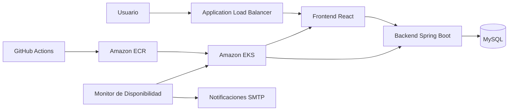
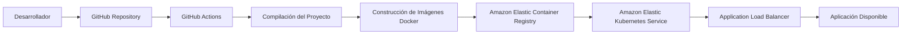
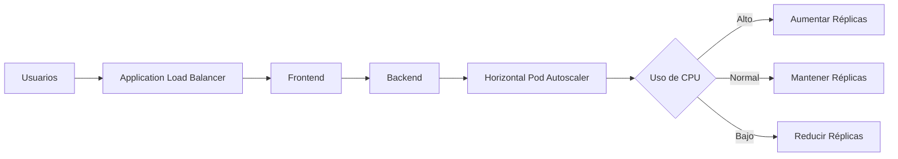
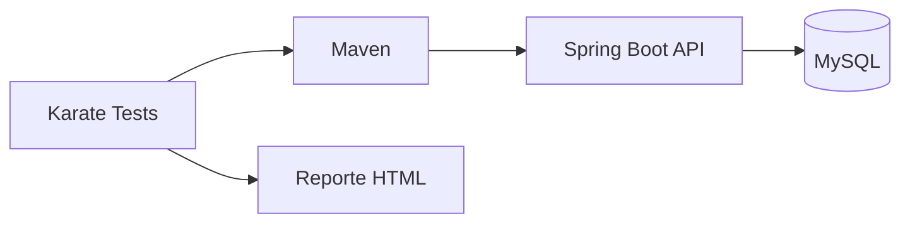
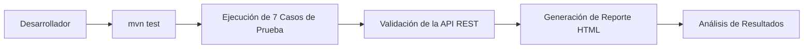
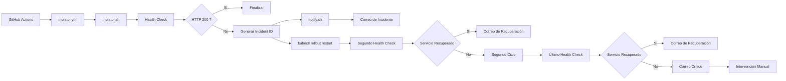

# 🐶 Tienda Perritos

<div align="center">

## Plataforma DevOps desplegada sobre Amazon EKS

Proyecto desarrollado como parte de la **Evaluación Transversal (ET)** de la asignatura **Introducción a Herramientas DevOps**, integrando contenedores Docker, Amazon Web Services, Kubernetes y un pipeline de Integración y Despliegue Continuo mediante GitHub Actions.

---


</div>

---

# 📖 Descripción

**Tienda Perritos** es una plataforma web orientada a la administración de productos para una tienda de mascotas. El proyecto fue evolucionando durante el semestre hasta convertirse en una solución completamente desplegada sobre **Amazon Elastic Kubernetes Service (Amazon EKS)**, incorporando automatización mediante **GitHub Actions**, almacenamiento de imágenes en **Amazon ECR**, escalado automático, pruebas automatizadas con **Karate Framework** y un sistema de monitoreo con recuperación automática y notificaciones por correo electrónico.

Más que una aplicación web, este proyecto representa la integración práctica de distintas herramientas y metodologías DevOps para construir un entorno automatizado, escalable y preparado para escenarios similares a producción.

---
# 📌 Estado del Proyecto

| Estado | Descripción |
|---------|-------------|
| ✅ Finalizado | Proyecto completamente funcional |
| 🚀 Despliegue | Amazon Elastic Kubernetes Service (Amazon EKS) |
| 🔄 Integración Continua | GitHub Actions |
| 📦 Registro de Imágenes | Amazon Elastic Container Registry (Amazon ECR) |
| 📈 Escalado | Horizontal Pod Autoscaler (HPA) |
| 🧪 Pruebas Automatizadas | Karate Framework |
| ❤️ Monitoreo | Health Check + Recuperación Automática + Notificaciones SMTP |

---

# 👥 Integrantes

| Nombre | Rol |
|---------|-----|
| **Mar Guerra** | Desarrollo, AWS Cloud, Kubernetes, CI/CD |
| **Matías Vergara** | Desarrollo, Backend, Automatización y Testing |

---

# 🎯 Objetivos del Proyecto

Este proyecto tuvo como propósito aplicar de forma práctica los principales conceptos abordados durante la asignatura **Introducción a Herramientas DevOps**, integrando tecnologías modernas para automatizar el ciclo completo de desarrollo, despliegue y operación de una aplicación web.

Entre los principales objetivos se encuentran:

- Implementar una arquitectura basada en contenedores Docker.
- Automatizar el despliegue mediante un Pipeline CI/CD.
- Desplegar la solución sobre Amazon Elastic Kubernetes Service (EKS).
- Gestionar imágenes mediante Amazon Elastic Container Registry (ECR).
- Implementar escalado automático utilizando Kubernetes.
- Incorporar pruebas automatizadas mediante Karate Framework.
- Implementar un monitor de disponibilidad con recuperación automática y notificaciones por correo electrónico.

---

# 📚 Contenido

- [Descripción General](#-descripción-general)
- [Arquitectura de la Solución](#-arquitectura-de-la-solución)
- [Pipeline CI/CD](#-pipeline-cicd)
- [Tecnologías Utilizadas](#-tecnologías-utilizadas)
- [Infraestructura AWS](#-infraestructura-aws)
- [Amazon Kubernetes Service (EKS)](#-amazon-kubernetes-service-eks)
- [Escalado Automático](#-escalado-automático)
- [Mejora 1 - Pruebas Automatizadas con Karate](#-mejora-1---pruebas-automatizadas-con-karate)
- [Mejora 2 - Monitor Automático de Disponibilidad](#-mejora-2---monitor-automático-de-disponibilidad)
- [Estructura del Proyecto](#-estructura-del-proyecto)
- [Herramientas Utilizadas](#-herramientas-utilizadas)
- [Autores](#-autores)

---
# 🏗️ Descripción General

La solución fue desarrollada siguiendo una arquitectura distribuida basada en microservicios ligeros y contenedores Docker, desplegada sobre **Amazon Elastic Kubernetes Service (Amazon EKS)**.

La aplicación está compuesta por un **Frontend desarrollado en React**, un **Backend desarrollado con Spring Boot** y una **Base de Datos MySQL**, todos desplegados mediante Kubernetes y expuestos a Internet a través de un **Application Load Balancer (ALB)**.

El ciclo completo de integración y despliegue es administrado mediante **GitHub Actions**, permitiendo automatizar la construcción de imágenes Docker, su publicación en Amazon Elastic Container Registry (Amazon ECR) y el despliegue automático hacia el clúster Kubernetes.

Como parte de las mejoras incorporadas durante la Evaluación Transversal, la solución integra además un sistema de **pruebas automatizadas mediante Karate Framework** y un **monitor automático de disponibilidad**, encargado de detectar incidentes, ejecutar acciones de recuperación y notificar el estado del servicio mediante correo electrónico.

---

# 🏛️ Arquitectura de la Solución



---

## Componentes Principales

| Componente | Descripción |
|------------|-------------|
| **Frontend** | Interfaz web desarrollada con React para la gestión de productos. |
| **Backend** | API REST desarrollada con Spring Boot encargada de la lógica de negocio. |
| **Base de Datos** | Motor MySQL utilizado para almacenar la información de la aplicación. |
| **Amazon EKS** | Plataforma de orquestación encargada de administrar los contenedores. |
| **Amazon ECR** | Registro privado donde se almacenan las imágenes Docker del proyecto. |
| **GitHub Actions** | Plataforma utilizada para automatizar el Pipeline CI/CD. |
| **Karate Framework** | Herramienta utilizada para ejecutar pruebas automatizadas sobre la API REST. |
| **Monitor de Disponibilidad** | Sistema desarrollado para detectar incidentes, ejecutar recuperación automática y enviar notificaciones por correo electrónico. |

---
# 🔄 Pipeline CI/CD

Uno de los principales objetivos del proyecto fue automatizar el proceso de integración y despliegue continuo, eliminando tareas manuales y garantizando que cada modificación realizada sobre el repositorio pueda ser compilada, validada y desplegada de forma consistente.

Para ello se implementó un Pipeline CI/CD utilizando **GitHub Actions**, encargado de construir la aplicación, generar las imágenes Docker, publicarlas en **Amazon Elastic Container Registry (Amazon ECR)** y desplegar automáticamente la nueva versión sobre el clúster **Amazon Elastic Kubernetes Service (Amazon EKS)**.

---

## Flujo del Pipeline



---

## Etapas del Pipeline

| Etapa | Descripción |
|-------|-------------|
| 📥 Checkout | Obtiene el código fuente desde GitHub. |
| ☕ Build | Compila el proyecto y verifica la integridad del código. |
| 🐳 Docker Build | Construye las imágenes Docker del Frontend y Backend. |
| ☁️ Amazon ECR | Publica las imágenes en el registro privado de AWS. |
| ☸️ Amazon EKS | Actualiza automáticamente los Deployments del clúster Kubernetes. |
| 🚀 Despliegue | La nueva versión queda disponible para los usuarios mediante el Load Balancer. |

---

## Beneficios de la Automatización

La implementación del Pipeline CI/CD permitió reducir considerablemente el tiempo necesario para desplegar nuevas versiones de la aplicación, minimizando errores manuales y asegurando un proceso de despliegue repetible y confiable.

Además, la integración con Amazon EKS facilita la actualización controlada de los servicios desplegados, permitiendo mantener la disponibilidad de la aplicación durante cada despliegue.

---

## Evidencias

> 📷 **Agregar las siguientes capturas:**

- Workflow principal ejecutado correctamente.
- Ejecución exitosa de GitHub Actions.
- Publicación de imágenes en Amazon ECR.
- Actualización automática del Deployment en Amazon EKS.

---
# 🛠️ Tecnologías Utilizadas

El desarrollo de **Tienda Perritos** integró distintas herramientas y plataformas utilizadas habitualmente en proyectos DevOps modernos. Cada una de ellas cumple una función específica dentro del ciclo de vida de la aplicación, desde el desarrollo y la automatización hasta el despliegue y monitoreo.

| Tecnología | Función dentro del proyecto |
|------------|-----------------------------|
| ☕ Java 17 | Lenguaje utilizado para el desarrollo del Backend. |
| 🌱 Spring Boot | Framework utilizado para construir la API REST. |
| ⚛️ React | Desarrollo de la interfaz web del sistema. |
| 🐬 MySQL | Motor de base de datos relacional utilizado por la aplicación. |
| 🐳 Docker | Contenerización del Frontend, Backend y Base de Datos. |
| 📦 Docker Compose | Orquestación del entorno de desarrollo local. |
| ☁️ Amazon Web Services (AWS) | Plataforma Cloud utilizada para alojar la infraestructura del proyecto. |
| ☸️ Amazon Elastic Kubernetes Service (EKS) | Orquestación de contenedores en producción. |
| 📦 Amazon Elastic Container Registry (ECR) | Registro privado para almacenar las imágenes Docker. |
| ⚙️ GitHub Actions | Automatización del Pipeline de Integración y Despliegue Continuo (CI/CD). |
| 🔑 GitHub Secrets | Almacenamiento seguro de credenciales y variables sensibles. |
| 🖥️ AWS CLI | Administración de recursos AWS desde el Pipeline. |
| ☸️ kubectl | Administración del clúster Kubernetes. |
| 🧪 Maven | Compilación del proyecto y ejecución de pruebas automatizadas. |
| 🥋 Karate Framework | Automatización de pruebas funcionales para la API REST. |
| 📧 Gmail SMTP | Servicio utilizado para el envío de notificaciones por correo electrónico. |
| 📨 msmtp | Cliente SMTP utilizado por el monitor para enviar correos desde GitHub Actions. |
| 💻 Visual Studio Code | Entorno de desarrollo utilizado durante la implementación del proyecto. |
| 🌐 Git | Control de versiones distribuido. |
| 🐙 GitHub | Repositorio remoto y plataforma colaborativa del proyecto. |

---

## Integración Tecnológica

Uno de los principales objetivos del proyecto fue integrar todas estas herramientas en una única solución automatizada. La combinación de tecnologías permitió construir una arquitectura donde el desarrollo, la integración continua, el despliegue y el monitoreo funcionan de forma coordinada, reduciendo la intervención manual y facilitando la operación del sistema.

La incorporación de herramientas como **Karate Framework** y el **Monitor Automático de Disponibilidad** representan mejoras desarrolladas durante la Evaluación Transversal, agregando capacidades de validación automática y recuperación del servicio que no formaban parte de la versión inicial del proyecto.

---
# ☁️ Infraestructura AWS

La infraestructura del proyecto fue implementada completamente sobre **Amazon Web Services (AWS)**, utilizando servicios administrados que permiten desplegar la aplicación en un entorno escalable, seguro y preparado para producción.

La arquitectura final integra servicios de red, almacenamiento de imágenes Docker, orquestación mediante Kubernetes y balanceo de carga, permitiendo automatizar completamente el proceso de despliegue desde GitHub Actions.

---

## Componentes de la Infraestructura

| Servicio AWS | Función |
|--------------|---------|
| 🌐 Amazon VPC | Red privada donde se ejecutan todos los recursos del proyecto. |
| 🔀 Subredes Públicas y Privadas | Segmentación de la infraestructura y distribución de recursos. |
| 🔒 Security Groups | Control del tráfico de entrada y salida entre los distintos componentes. |
| 👤 IAM | Gestión de permisos y acceso seguro a los servicios de AWS. |
| 📦 Amazon Elastic Container Registry (ECR) | Almacenamiento de imágenes Docker utilizadas por Kubernetes. |
| ☸️ Amazon Elastic Kubernetes Service (EKS) | Administración del clúster Kubernetes donde se ejecuta la aplicación. |
| ⚖️ Application Load Balancer | Distribución del tráfico HTTP hacia los Pods del clúster. |

---

## Arquitectura Implementada

> 📷 **Agregar aquí una captura general de la infraestructura AWS.**

---

## Amazon Virtual Private Cloud (VPC)

La solución se encuentra desplegada dentro de una **Amazon VPC**, proporcionando aislamiento de red y permitiendo controlar la comunicación entre los distintos servicios utilizados por la aplicación.

> 📷 **Agregar captura de la VPC creada.**

---

## Security Groups

Los **Security Groups** fueron configurados para controlar el acceso entre los componentes del sistema, permitiendo únicamente las comunicaciones necesarias para el funcionamiento de la aplicación y restringiendo accesos no autorizados.

> 📷 **Agregar captura de los Security Groups.**

---

## Amazon Elastic Kubernetes Service (EKS)

El clúster Kubernetes constituye el núcleo de la solución, siendo responsable de ejecutar los contenedores, administrar los Deployments, ReplicaSets y Pods, además de facilitar el escalado automático de la aplicación.

> 📷 **Agregar captura del clúster Amazon EKS.**

---

## Amazon Elastic Container Registry (ECR)

Las imágenes Docker del Frontend y Backend son publicadas automáticamente en **Amazon ECR** mediante el Pipeline CI/CD, permitiendo que Kubernetes despliegue siempre la versión más reciente de la aplicación.

> 📷 **Agregar captura de los repositorios ECR.**

---

## Estado Final de la Infraestructura

La infraestructura implementada proporciona una plataforma completamente funcional para el despliegue automatizado de la aplicación, integrando servicios administrados de AWS que facilitan la operación, el mantenimiento y la escalabilidad del sistema.

---

# 📈 Escalado Automático

Uno de los principales objetivos del despliegue sobre Kubernetes fue aprovechar las capacidades de **escalado automático** proporcionadas por **Horizontal Pod Autoscaler (HPA)**.

Esta funcionalidad permite que la aplicación aumente o disminuya automáticamente la cantidad de Pods disponibles según la carga de trabajo, garantizando una mejor utilización de los recursos y manteniendo la disponibilidad del servicio.

---

## Funcionamiento

El proceso de escalado implementado sigue el siguiente flujo:



---

## Beneficios del Escalado Automático

- Incremento automático de réplicas cuando aumenta la carga del sistema.
- Reducción automática de recursos cuando disminuye la demanda.
- Mayor disponibilidad de la aplicación.
- Optimización del consumo de recursos del clúster Kubernetes.
- Disminución de la intervención manual durante la operación del sistema.

---

## Recursos Implementados

Durante el desarrollo del proyecto se configuraron los siguientes componentes de Kubernetes para soportar el escalado automático:

| Recurso | Función |
|----------|---------|
| **Deployment** | Administración del ciclo de vida de los Pods. |
| **ReplicaSet** | Mantiene la cantidad de réplicas disponibles. |
| **Horizontal Pod Autoscaler (HPA)** | Ajusta automáticamente el número de Pods según la utilización de CPU. |
| **Metrics Server** | Proporciona las métricas necesarias para el funcionamiento del HPA. |

---

## Evidencias

> 📷 **Agregar las siguientes capturas:**

- Configuración del Horizontal Pod Autoscaler.
- Resultado del comando `kubectl get hpa`.
- Incremento de réplicas durante la prueba.
- Disminución automática de réplicas al finalizar la carga.
- Captura correspondiente al video de demostración.

---

## Resultado

La implementación del **Horizontal Pod Autoscaler** permitió comprobar que la plataforma responde automáticamente frente a variaciones en la carga de trabajo, incrementando o reduciendo la cantidad de Pods disponibles sin afectar la continuidad del servicio.

Esta característica representa una de las principales ventajas de utilizar Kubernetes como plataforma de orquestación para aplicaciones desplegadas en la nube.

---

# 🥋 Mejora 1 - Pruebas Automatizadas con Karate Framework

## Objetivo

Durante las etapas finales del proyecto se identificó la necesidad de incorporar un mecanismo que permitiera validar automáticamente el correcto funcionamiento de la API REST después de cada modificación realizada sobre el sistema.

Con este propósito se implementó **Karate Framework**, una herramienta especializada en pruebas automatizadas para servicios REST, capaz de ejecutar escenarios de prueba utilizando una sintaxis simple y generar reportes detallados sobre los resultados obtenidos.

La incorporación de esta mejora permitió aumentar la confiabilidad del proyecto y facilitar la detección temprana de posibles errores antes del despliegue de nuevas versiones.

---

## Arquitectura de la Solución



---

## Flujo de Ejecución



---

## Componentes Incorporados

Como parte de esta mejora se incorporaron nuevos componentes al proyecto:

| Componente | Función |
|------------|---------|
| Karate Framework | Automatización de pruebas sobre la API REST. |
| Maven Surefire | Ejecución automática de los casos de prueba. |
| KarateTest.java | Clase principal encargada de ejecutar todos los escenarios. |
| Archivos *.feature | Definición de los distintos casos de prueba. |
| Reporte HTML | Visualización detallada del resultado obtenido por cada prueba. |

---

## Casos de Prueba Implementados

Los escenarios desarrollados permiten validar las principales operaciones disponibles en la API REST, verificando tanto el comportamiento esperado como las respuestas entregadas por el sistema.

Entre las validaciones realizadas se encuentran:

- Consulta de productos.
- Obtención de productos por identificador.
- Creación de nuevos registros.
- Actualización de información.
- Eliminación de registros.
- Validación de códigos de respuesta HTTP.
- Verificación del contenido devuelto por la API.

---

## Beneficios Obtenidos

La incorporación de Karate Framework permitió automatizar un proceso que anteriormente debía realizarse de forma manual, entregando mayor seguridad durante el desarrollo y facilitando la validación continua del sistema.

Además, la generación automática de reportes HTML proporciona una visión clara del estado de las pruebas ejecutadas y permite identificar rápidamente posibles fallos en la aplicación.

---

## Evidencias

> 📷 **Agregar las siguientes capturas:**

- Configuración del proyecto Karate.
- Estructura de carpetas.
- Ejecución de `mvn test`.
- Resultado **BUILD SUCCESS**.
- Reporte HTML general.
- Vista de cada uno de los casos de prueba.

---
# ❤️ Mejora 2 - Monitor Automático de Disponibilidad

## Objetivo

Como parte de las mejoras incorporadas durante la Evaluación Transversal, se desarrolló un sistema de monitoreo automático orientado a verificar continuamente la disponibilidad de la aplicación desplegada sobre **Amazon Elastic Kubernetes Service (Amazon EKS)**.

El objetivo principal de esta mejora fue reducir los tiempos de respuesta frente a incidentes, automatizando tanto la detección de fallos como el proceso de recuperación del servicio, minimizando la necesidad de intervención manual.

---

## Problema Detectado

En la versión inicial del proyecto, la aplicación dependía completamente de la supervisión manual.

Si el Backend dejaba de responder, era necesario que un administrador detectara el problema, ingresara al clúster Kubernetes y ejecutara manualmente el reinicio del Deployment correspondiente.

Este procedimiento incrementaba el tiempo de indisponibilidad del servicio y dificultaba la administración de la plataforma.

---

## Solución Implementada

Para resolver este problema se desarrolló un monitor completamente automatizado ejecutado mediante **GitHub Actions**, capaz de:

- Verificar periódicamente la disponibilidad del servicio.
- Detectar automáticamente respuestas HTTP diferentes de **200 OK**.
- Generar un identificador único para cada incidente.
- Ejecutar automáticamente el reinicio del Deployment afectado.
- Realizar hasta **dos ciclos completos de recuperación**.
- Registrar el tiempo aproximado de indisponibilidad del servicio.
- Notificar el estado del incidente mediante correo electrónico.
- Solicitar intervención manual únicamente cuando ambos ciclos de recuperación fallan.

---

# Arquitectura del Monitor



---

# Componentes Incorporados

La implementación del monitor requirió incorporar nuevos componentes al proyecto:

| Componente | Función |
|------------|---------|
| **monitor.yml** | Workflow encargado de programar y ejecutar el monitor. |
| **monitor.sh** | Script principal responsable de verificar la disponibilidad y ejecutar la recuperación automática. |
| **notify.sh** | Script encargado de generar y enviar las notificaciones mediante SMTP. |
| **GitHub Secrets** | Almacenamiento seguro de las credenciales AWS y SMTP. |
| **msmtp** | Cliente SMTP utilizado para el envío de correos electrónicos. |

---

# Flujo de Recuperación

El proceso implementado considera dos oportunidades de recuperación antes de solicitar intervención manual.

1. Se detecta un incidente mediante un Health Check.
2. Se genera un identificador único del incidente.
3. Se envía un correo notificando la interrupción del servicio.
4. Se ejecuta un reinicio automático del Deployment mediante Kubernetes.
5. Se verifica nuevamente el estado del servicio.
6. Si la recuperación fue exitosa, se informa mediante un correo de recuperación.
7. Si el servicio continúa indisponible, se ejecuta un segundo ciclo de recuperación.
8. En caso de persistir el problema, se envía un correo solicitando intervención manual.

---

# Beneficios Obtenidos

La implementación del monitor permitió incorporar capacidades de operación similares a las utilizadas en entornos reales de producción.

Entre los principales beneficios destacan:

- Detección automática de incidentes.
- Reducción del tiempo de indisponibilidad.
- Recuperación automática del servicio.
- Registro individual de cada incidente mediante un identificador único.
- Notificaciones automáticas durante todo el ciclo de recuperación.
- Disminución de la intervención manual por parte del administrador.

---

# Evidencias

> 📷 **Agregar las siguientes capturas:**

- Workflow `monitor.yml`.
- Ejecución del monitor desde GitHub Actions.
- `monitor.sh`.
- `notify.sh`.
- Health Check ejecutándose.
- Reinicio automático del Deployment.
- Correos de incidente.
- Correos de recuperación.
- Correo de intervención manual.
- GitHub Secrets utilizados por el monitor.

---

# 📂 Estructura del Proyecto

El proyecto fue organizado siguiendo una estructura modular que facilita el mantenimiento, la separación de responsabilidades y la automatización del proceso de despliegue.

```text
Tienda-Perritos
│
├── .github/
│   └── workflows/
│       ├── ci-cd.yml
│       └── monitor.yml
│
├── backend/
│   ├── src/
│   ├── Dockerfile
│   └── pom.xml
│
├── frontend/
│   ├── src/
│   ├── public/
│   ├── Dockerfile
│   └── package.json
│
├── db/
│   ├── init.sql
│   └── Dockerfile
│
├── k8s/
│   ├── deployment-backend.yaml
│   ├── deployment-frontend.yaml
│   ├── service-backend.yaml
│   ├── service-frontend.yaml
│   ├── ingress.yaml
│   └── hpa.yaml
│
├── scripts/
│   ├── monitor.sh
│   └── notify.sh
│
├── karate/
│   ├── features/
│   ├── KarateTest.java
│   └── pom.xml
│
├── docker-compose.yml
├── README.md
└── LICENSE
```

---

# 📁 Descripción de Carpetas

| Carpeta | Descripción |
|----------|-------------|
| **.github/workflows** | Contiene los Workflows utilizados por GitHub Actions para automatizar el Pipeline CI/CD y el monitor de disponibilidad. |
| **backend** | Código fuente de la API REST desarrollada con Spring Boot. |
| **frontend** | Aplicación web desarrollada utilizando React. |
| **db** | Recursos relacionados con la base de datos MySQL. |
| **k8s** | Archivos YAML utilizados para desplegar la aplicación sobre Amazon EKS. |
| **scripts** | Scripts Bash encargados del monitoreo automático y del envío de notificaciones. |
| **karate** | Proyecto destinado a la ejecución de pruebas automatizadas utilizando Karate Framework. |

---

# 🔐 Gestión de Credenciales

Con el propósito de proteger la información sensible del proyecto, todas las credenciales utilizadas durante el despliegue fueron almacenadas mediante **GitHub Secrets**, evitando que datos críticos quedaran expuestos dentro del código fuente.

Entre las principales credenciales utilizadas se encuentran:

- AWS Access Key ID
- AWS Secret Access Key
- AWS Session Token
- SMTP Server
- SMTP Username
- SMTP Password
- Destinatarios de las notificaciones

Esta estrategia permitió mantener una adecuada separación entre el código de la aplicación y la configuración del entorno de ejecución, siguiendo buenas prácticas de seguridad en proyectos DevOps.

---

# 🏆 Resultados del Proyecto

Al finalizar el desarrollo de **Tienda Perritos**, se logró construir una plataforma completamente funcional desplegada sobre **Amazon Web Services**, incorporando herramientas modernas de automatización, orquestación y monitoreo propias de un entorno DevOps.

Los objetivos planteados al inicio del proyecto fueron alcanzados satisfactoriamente, permitiendo integrar tecnologías utilizadas habitualmente en escenarios reales de desarrollo y operación de software.

---

## Funcionalidades Implementadas

| Componente | Estado |
|------------|:------:|
| Aplicación Web React | ✅ |
| API REST Spring Boot | ✅ |
| Base de Datos MySQL | ✅ |
| Contenedores Docker | ✅ |
| Docker Compose | ✅ |
| Amazon Elastic Container Registry (ECR) | ✅ |
| Amazon Elastic Kubernetes Service (EKS) | ✅ |
| GitHub Actions | ✅ |
| Pipeline CI/CD Automatizado | ✅ |
| Horizontal Pod Autoscaler (HPA) | ✅ |
| Escalado Automático | ✅ |
| Pruebas Automatizadas con Karate | ✅ |
| Monitor Automático de Disponibilidad | ✅ |
| Recuperación Automática | ✅ |
| Notificaciones mediante SMTP | ✅ |
| Documentación Técnica | ✅ |

---

## Competencias Desarrolladas

Durante el desarrollo del proyecto fue posible aplicar conocimientos relacionados con:

- Arquitecturas basadas en contenedores.
- Integración Continua (CI).
- Despliegue Continuo (CD).
- Administración de clústeres Kubernetes.
- Servicios Cloud sobre Amazon Web Services.
- Automatización mediante GitHub Actions.
- Pruebas automatizadas de APIs REST.
- Monitoreo y recuperación automática de servicios.
- Gestión segura de credenciales mediante GitHub Secrets.
- Documentación técnica de proyectos DevOps.

---

## Principales Logros

- Automatización completa del proceso de despliegue.
- Reducción de tareas manuales mediante CI/CD.
- Implementación de un entorno escalable utilizando Kubernetes.
- Incorporación de pruebas automatizadas para validar la API.
- Desarrollo de un monitor capaz de detectar incidentes y ejecutar acciones de recuperación automática.
- Integración de notificaciones por correo electrónico para informar el estado del servicio.
- Consolidación de una arquitectura moderna basada en servicios administrados de AWS.

---

## Resultado Final

El proyecto evolucionó desde una aplicación web desarrollada localmente hasta una solución completamente desplegada sobre la nube, integrando automatización, contenedores, orquestación, pruebas y monitoreo.

Las mejoras implementadas durante la Evaluación Transversal fortalecieron significativamente la calidad y disponibilidad del sistema, permitiendo obtener una solución más robusta, mantenible y cercana a un entorno real de producción.

---
# 🚀 Futuras Mejoras

Aunque el proyecto alcanzó los objetivos propuestos para esta Evaluación Transversal, existen diversas oportunidades para continuar evolucionando la plataforma, incorporando herramientas utilizadas habitualmente en entornos DevOps y arquitecturas Cloud modernas.

Las siguientes mejoras representan una posible hoja de ruta para futuras versiones del proyecto.

---

## Observabilidad

| Herramienta | Objetivo |
|-------------|----------|
| 📊 Prometheus | Recolección de métricas del clúster Kubernetes y de la aplicación. |
| 📈 Grafana | Visualización de métricas mediante paneles de monitoreo en tiempo real. |
| 📜 Loki | Centralización y consulta de registros (logs) de la aplicación. |

---

## Integración y Entrega Continua

| Herramienta | Objetivo |
|-------------|----------|
| 🚀 Argo CD | Implementar una estrategia GitOps para el despliegue continuo sobre Kubernetes. |
| 📦 Helm | Gestionar los manifiestos Kubernetes mediante Charts reutilizables y parametrizables. |

---

## Calidad del Software

| Herramienta | Objetivo |
|-------------|----------|
| 🔍 SonarQube | Incorporar análisis estático de código y métricas de calidad. |
| 🛡️ Trivy | Analizar vulnerabilidades en imágenes Docker antes del despliegue. |

---

## Monitoreo

El monitor desarrollado durante este proyecto constituye una primera aproximación a un sistema de operación automatizada. En futuras versiones podrían incorporarse nuevas capacidades, tales como:

- Monitoreo de múltiples Deployments simultáneamente.
- Integración con Microsoft Teams o Slack para el envío de alertas.
- Registro histórico de incidentes.
- Dashboard para visualizar disponibilidad y métricas.
- Integración con Amazon CloudWatch.
- Reintentos configurables según el tipo de incidente.

---

## Automatización

Como evolución natural del Pipeline CI/CD podrían incorporarse nuevas etapas automáticas, entre ellas:

- Ejecución automática de pruebas Karate dentro del Pipeline.
- Validación de seguridad antes del despliegue.
- Aprobaciones manuales para ambientes de producción.
- Estrategias de despliegue Blue/Green o Canary.
- Versionado automático de imágenes Docker.

---

## Visión del Proyecto

La arquitectura implementada durante este proyecto proporciona una base sólida para continuar evolucionando la solución hacia un entorno cada vez más automatizado, seguro y resiliente.

Las mejoras propuestas buscan fortalecer aspectos relacionados con la observabilidad, la calidad del software y la operación continua, manteniendo el enfoque DevOps que dio origen al desarrollo de la plataforma.

---

# 👥 Autores

Este proyecto fue desarrollado por estudiantes de **Duoc UC** como parte de la asignatura **Introducción a Herramientas DevOps**, integrando conocimientos relacionados con contenedorización, automatización, integración continua, despliegue sobre la nube y orquestación mediante Kubernetes.

| Integrante | Participación |
|------------|---------------|
| **Mar Guerra** | Arquitectura Cloud, Amazon Web Services, Kubernetes, CI/CD, automatización y documentación técnica. |
| **Matías Vergara** | Desarrollo Backend, automatización de pruebas, integración del sistema y documentación técnica. |

---

# 📚 Recursos Utilizados

Durante el desarrollo del proyecto se utilizaron las siguientes fuentes oficiales de documentación y referencia técnica:

- Documentación oficial de Amazon Web Services (AWS)
- Documentación oficial de Kubernetes
- Documentación oficial de Docker
- Documentación oficial de GitHub Actions
- Documentación oficial de Spring Boot
- Documentación oficial de React
- Documentación oficial de Karate Framework
- Documentación oficial de Maven

Estas referencias permitieron implementar las distintas tecnologías utilizadas siguiendo las recomendaciones y buenas prácticas propuestas por sus respectivos fabricantes.

---

# 📄 Licencia

Este proyecto fue desarrollado con fines exclusivamente académicos como parte de la **Evaluación Transversal (ET)** de la asignatura **Introducción a Herramientas DevOps** de **Duoc UC**.

Su contenido puede ser utilizado únicamente como material de apoyo para fines educativos.

---

# 🙏 Agradecimientos

Agradecemos a los docentes de la asignatura por acompañar el desarrollo del proyecto durante el semestre y entregar los conocimientos necesarios para comprender las distintas herramientas utilizadas en el ecosistema DevOps.

Asimismo, agradecemos el acceso a plataformas y servicios que hicieron posible implementar una solución basada en tecnologías utilizadas actualmente en entornos profesionales.

---

# ⭐ Conclusión

El desarrollo de **Tienda Perritos** representó una oportunidad para integrar, en un único proyecto, herramientas y metodologías utilizadas durante todo el semestre.

La solución final permitió combinar **Docker**, **Amazon Web Services**, **Amazon Elastic Kubernetes Service (EKS)**, **GitHub Actions**, **Amazon Elastic Container Registry (ECR)**, **Horizontal Pod Autoscaler**, **Karate Framework** y un **Monitor Automático de Disponibilidad**, consolidando una plataforma capaz de automatizar el despliegue, validar el funcionamiento de la aplicación y responder automáticamente frente a incidentes.

Más allá de cumplir con los objetivos de la asignatura, este proyecto permitió comprender cómo distintas tecnologías DevOps pueden trabajar de forma integrada para construir soluciones más escalables, mantenibles y cercanas a un entorno real de producción.

---
**
<div align="center">

### ⭐ Gracias por visitar nuestro proyecto ⭐

**Tienda Perritos en Amazon AWS**

*Evaluación Transversal - Introducción a Herramientas DevOps*

**Duoc UC · 2026**

</div>
